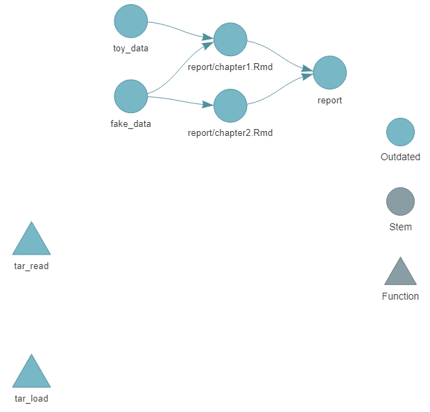
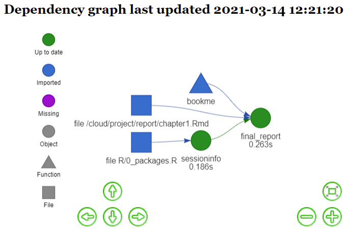

<!-- README.md is generated from README.Rmd. Please edit that file -->

# flowme

<!-- badges: start -->

[](https://app.codecov.io/gh/edalfon/flowme?branch=master)
[](https://github.com/edalfon/flowme/actions)
<!-- badges: end -->

A little package to quickly include templates for our project structures
and workflows.

## Installation

``` r
# install.packages("remotes") # just in case
remotes::install_github("edalfon/flowme")
```

## Example: setup a {targets} project

A very thin -yet fully functional- template for a `{targets}` project.

You just type:

``` r
flowme::use_targets() # alias flowme::targetsme()
```

And get the bare bones infrastructure for a `{targets}` project that
compiles a report using `{bookdown}`. Then you can simply run the
pipeline (`targets::tar_make()`) to compile a sample report that should
get you started.

Here’s how the sample pipeline looks like:

``` r
targets::tar_visnetwork()
```

<!-- -->

See some more details in `vignette("targetsme", package = "flowme")`

## Example: setup a {drake} project

Having `flowme` installed, you would only need to call

``` r
flowme::drakeme()
```

It gets you started to an empty but ready-to-fly drake project
(including key dependencies).

Using `drake::vis_drake_graph()` you can peek at the drake dependency
graph for this boilerplate.

<!-- -->

This is already a fully functional project that you can run by calling
`drake::r_make()` and it compiles a sample report.

Now, you only need to do your thing in drake plans, include them as
indicated in `_drake.R`, write your results in `Rmd` files within the
`report` directory and simply call `drake::r_make()` to render them all
into a book.

See some more details in `vignette("drakeme", package = "flowme")`

## [More details](https://edalfon.github.io/flowme/articles/flowme.html)

More details on the proposed workflow in [`flowme`’s web
site](https://edalfon.github.io/flowme/articles/flowme.html)
